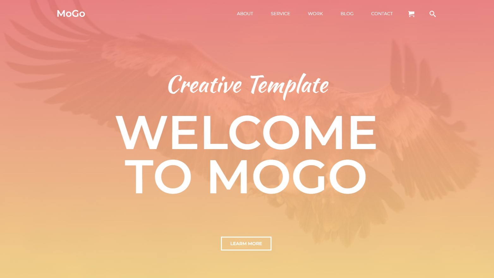
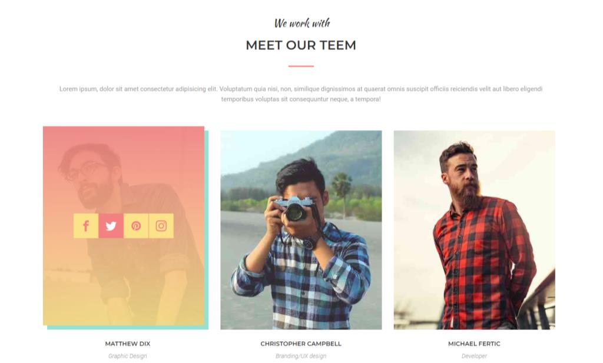
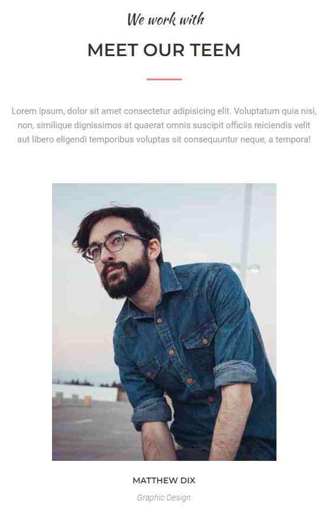

# MoGo template

&nbsp;

## Table of contents

[⭐ Overview](#⭐-overview)

- [Links](#links)
- [Screenshot](#screenshot)

[💡 My process](#💡-my-process)

- [Technologies](#Technologies)
- [Useful resources](#useful-resources)
- [Copyrights](#copyrights)

[🙋‍♂️ Author](#🙋‍♂️-author)

[👏 Special Thanks](#👏-special-thanks)

&nbsp;

## ⭐ Overview

&nbsp;

### **Links:**

- [GitHub](https://github.com/kowackag/Excursion-Form.git);
- [Live](https://kowackag.github.io/mogo-recruitment/)

### **Screenshot:**

&nbsp;
Desktop:

Mobile:

## 💡 My process

&nbsp;

### **Technologies:**

&nbsp;

### **Useful resources:**

- [Google Font](https://fonts.google.com/specimen/Poppins) - Font (`Poppins`);
- [Icomoon](https://icomoon.io/) - Icons.

&nbsp;

## 🙋‍♂️ Author

The project was made by Małgorzata Kowacka.

- kowackag@gmail.com
- GitHub - [kowackag](https://github.com/kowackag)
- Linked - [Małgorzata Kowacka](https://www.linkedin.com/in/ma%C5%82gorzata-kowacka-0258a812a/)

  **If you have any questions do not hesitate to contact me.**

&nbsp;

## 👏 Special thanks

Thanks to my [GoIT](https://goit.global/pl/) - for providing me with this task and for code review.
